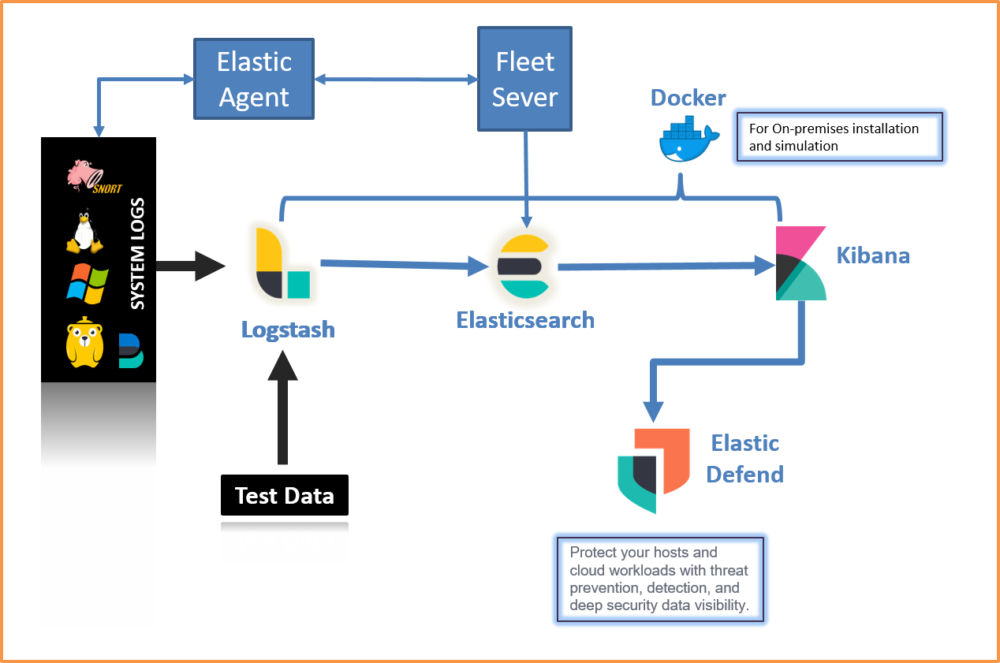

# NexGenSIEM_OpenSource_SOC
# NexGen SIEM: A Modern SOC Architeture for Evolving Threat Landscape

"NexGen SIEM" boosts SOC capabilities with open-source tech, centralizing data, automating incident response playbook generation, and enabling collaborative threat hunting. Integration with threat intel platforms enhances defense against cyber risks for a resilient Cybersecurity approach.

## Table of Contents
1. [Introdution](#Introduction)
2. [Architecture Diagram](#Architecture-Diagram)
3. [Components Used](#Components-Used)
4. [Features](#Features)
5. [Installation Requirements](#Installation-Requirements)
6. [Installation guide](#Installation-Guide)
7. [Contributing](#Contributing)
8. [Support](#Support)

# Introduction:

Welcome to NexGen SIEM, an innovative and open-source Security Information and Event Management (SIEM) solution designed to revolutionize Security Operations Centers (SOCs) and enhance cybersecurity capabilities.

In today's digital landscape, organizations face an ever-growing array of cyber threats and challenges. NexGen SIEM is built to address these challenges by providing a comprehensive platform for monitoring, analyzing, and responding to security events in real-time.

Our project leverages cutting-edge technologies such as Docker for efficient containerization, the ELK stack (Elasticsearch, Logstash, and Kibana) for log management and analysis, and a customized Winlogbeats agent (NexGen agent) for seamless log ingestion from Windows environments.

# Architecture-Diagram:

# Components-Used:

All components used in this project are Open Source.

- **Elastic SIEM**: Open-source SIEM platform powered by ElasticSearch, Logstash, and Kibana.

- **Beats Agents**: Lightweight data shippers for ingesting logs and data into Elastic SIEM. We utilize the Winlogbeats agent as the NexGen agent for Windows event log ingestion.

- **Docker**: Containerization technology used to deploy and manage the ELK stack components (Elasticsearch, Logstash, Kibana) in a scalable and efficient manner.

- **Kibana Query Language (KQL)**: Query language used in Kibana for analyzing and searching logs and data within the Elastic SIEM platform.

- **Fleet Server**: Centralized management server for managing and deploying Beats agents across multiple machines, enhancing scalability and control in log ingestion and management.

- **Elastic Security Features**: Integration of Elastic's security features including dashboards, rules, alerts, findings, cases, timelines, Intelligence, Explore, and Manage for comprehensive security monitoring and analysis.

# Features:

- Gain real-time visibility into security events and anomalies.
- Detect and respond to threats swiftly with customizable rules and alerts.
- Centralize log management and analysis for improved efficiency.
- Create custom dashboards and reports to visualize security posture.
- Integrate with other security tools and frameworks for enhanced defense-in-depth strategies.

Our project aims to empower cybersecurity professionals, streamline incident response workflows, and strengthen organizations' overall security posture in the face of evolving cyber threats.

# Installation-Requirements:

We need to create an environment in our own system using multiple virtual machines where few systems are considered as the user machines and few systems are dedicated for monitoring and threat analystics.

## VM Requirements:
- Elastic stack- Ubuntu (Latest Release)
- Fleet server- healthy high configured system either it may be windows server or Ubuntu server.

## Network Rules:
------------------------------------------------
|   Ports   |   IP Ranges   |   Component      |
|-----------|---------------|------------------|
|   9200    |    Our IP     |   Elastic Search |
|   5601    |    Our IP     |   Kibana UI      |
|   5044    |    Our IP     |   Logstash       |
|   8220    |    Our IP     |   Fleet Server   |
|   5403    |    Our IP     |   Beats Agents   |
|   8200    |    Our IP     |   APM            |
------------------------------------------------

# Installation Guide 
For Installation and setup please contact us 

Email: anuganti9@gmail.com / tharunadityaanuganti@gmail.com
Phone: 7989056568

# Contributing

We welcome your contributions, Please feel free to fork the code, play with it, make some patches and send us pull requests.

Before you contribute please refer the [contribution guidelines](https://github.com/Tharunaditya/NexGenSIEM_OpenSource_SOC/blob/main/CONTRIBUTING.md).

# Support 
- Please feel free to open an issue on Github
  if you'd like to report a bug or request a new feature
- If you are a non technical person and you need to setup this on premisies or on cloud please hire us!

# License
- This project is licensed under the MIT License - see the [LICENSE](https://github.com/Tharunaditya/NexGenSIEM_OpenSource_SOC/blob/main/LICENSE)  file for details 

